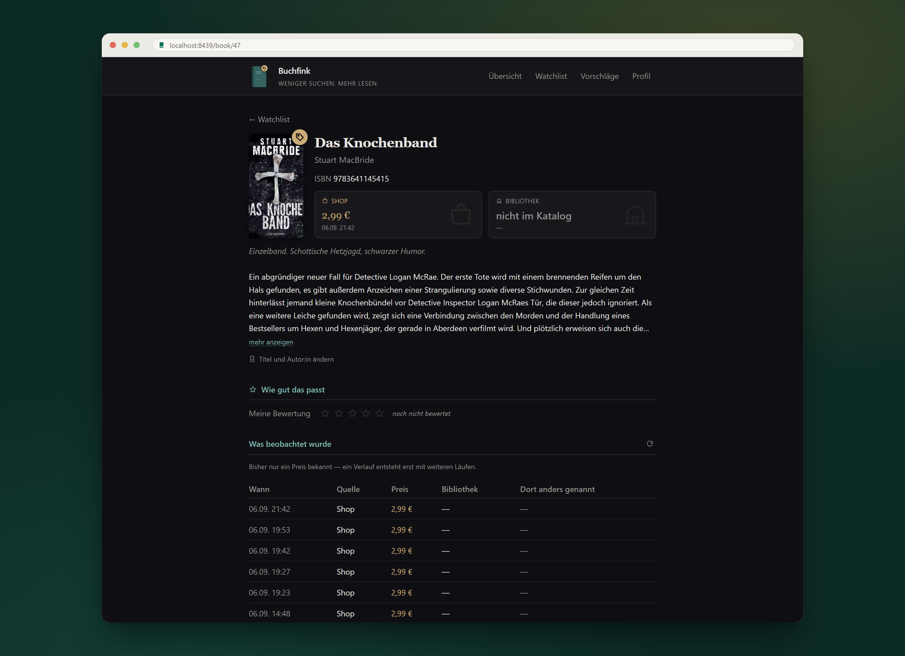

<p align="center">
  
</p>

# Buchfink

**Weniger Suchen. Mehr Lesen.**

Buchfink sieht jeden Tag nach, ob ein Titel deiner Watchlist in der Bibliothek
ausleihbar geworden ist oder im Shop billiger — und meldet sich nur, wenn sich
wirklich etwas geändert hat. Daneben schlägt er Bücher vor, die du noch nicht
kennst: ein Modell hält jeden Fund gegen ein schriftlich festgehaltenes
Leseprofil und sagt in einem Satz, warum das Buch für dich zählt.

Nichts wird weggeworfen. Jede Beobachtung wird angehängt, nie überschrieben,
und zu jedem Buch gibt es eine Seite mit dem ganzen Verlauf — jeder Preis,
jede Verfügbarkeit, mit Datum und Quelle.

Fokus: deutschsprachige Literatur. Zwei Quellen, beide hinter derselben
Schnittstelle; weitere lassen sich ergänzen, ohne den Kern anzufassen:

| Quelle | Art | Was sie liefert |
| --- | --- | --- |
| [VÖBB Onleihe](https://www.voebb.de) (Berlin) | Bibliothek | Verfügbarkeit, Länge der Vormerk-Warteschlange, Klappentext |
| [beam-shop.de](https://www.beam-shop.de) | Shop | Preis, Neuerscheinungen, Themenregale, Klappentext, Cover |

Es gibt keine Anmeldung und keine gespeicherten Zugangsdaten. Die Oberfläche
gehört ins Heimnetz, nicht ins offene Internet ([ADR 3](docs/adr/0003-local-web-ui.md)).

## Schnellstart

Voraussetzungen: Python 3.12 oder neuer und [uv](https://docs.astral.sh/uv/).

```bash
uv sync
mkdir -p data && cp examples/*.yaml data/
```

`data/profile.yaml` und `data/watchlist.yaml` anpassen (siehe
[Konfiguration](#konfiguration)), dann die Datenbank füllen und einen ersten
Lauf fahren:

```bash
uv run python -m ebook_watchlist.run seed
uv run python -m ebook_watchlist.run
```

Der erste Lauf sät Beobachtungen und schweigt; ab dem zweiten meldet er
Änderungen. Für die Oberfläche einmal die statischen Dateien bauen, dann
starten:

```bash
uv run tailwindcss_install && uv run python -m ebook_watchlist.web.build
uv run python -m ebook_watchlist.web
```

Danach unter `http://<rechner>:8437/` erreichbar, auch vom Telefon im selben
Netz. `--host 127.0.0.1` beschränkt sie auf diesen Rechner.

## Wie es arbeitet

Die Tiefe steht im [Rundgang](docs/rundgang.md); hier nur, was man wissen
muss, um die Ausgabe zu verstehen.

**Ein Lauf** ist *nachsehen → vergleichen → berichten*: jede Quelle nach dem
aktuellen Stand fragen, alles anhängend in SQLite schreiben, die neueste
Beobachtung je Produkt gegen die vorherige halten, und bei Änderungen oder
Fehlern einen Tagesbericht schreiben. Der Lauf vergleicht gegen die letzte
Aufzeichnung, nicht gegen „gestern" — ein ausgefallener Lauf geht nicht
verloren, der nächste holt nach. Zeitplaner, der Knopf „jetzt prüfen" und die
Kommandozeile gehen denselben Weg.

**Ein Watchlist-Titel wird immer gemeldet.** Er steht auf der Liste, weil er
gewollt ist. **Ein Fund muss sich qualifizieren:** er erreicht dich nur, wenn
er ausleihbar oder ein Schnäppchen ist. Schnäppchen kennt zwei Stufen, beide
im Profil einstellbar: unter 5,00 € ohne weitere Bedingung, von 5,00 bis
9,99 € nur mit mindestens 25 % Nachlass gegenüber dem zuletzt beobachteten
Preis. Wegen der Buchpreisbindung zeigt der Shop nie einen Streichpreis, ein
Nachlass ist also erst mit Preisgeschichte zu erkennen. Kostenlose Titel sind
kein Schnäppchen, sondern Füllmaterial.

**Das Bewertungstor** hält, was die Preisregel durchgelassen hat, gegen das
[Leseprofil](docs/leseprofil.yaml) — eine Prosabeschreibung dessen, was diese
Leserin mag. Wie daraus Sterne werden, steht getrennt davon im
[Bewertungsschema](docs/bewertungsschema.yaml)
([ADR 21](docs/adr/0021-leseprofil-und-bewertungsschema-trennen.md)). Jedes
Urteil trägt Sterne, eine Begründung, eine Sicherheitsangabe und einen Pitch.
Ohne `ANTHROPIC_API_KEY` fragt das Tor die lokal angemeldete
Claude-Code-Installation über `claude -p`. Ein Modellurteil ersetzt nie ein
eigenes: eine 4 von einem Menschen ist eine Tatsache, eine 4 von einem Modell
ein Vorschlag ([ADR 17](docs/adr/0017-book-rating-against-the-reading-profile.md)).

**Sammelausgaben** („3in1", „Titel A / Titel B") gelten als eigenes Buch mit
eigenem Vorteil: sie treten nicht als der gesuchte Einzelband auf, werden aber
gemeldet, wenn sie gegenüber den Einzelbänden spürbar günstiger sind
([ADR 24](docs/adr/0024-ein-buendel-ist-ein-eigenes-buch-mit-einem-eigenen-vorteil.md)).

## Die Oberfläche

Ein zweiter, unabhängiger Prozess. Er fragt selbst nie eine Quelle und hält
nie die Lauf-Sperre; ihn zu beenden stört keinen laufenden Lauf, und
umgekehrt.

| Seite | Wofür |
| --- | --- |
| **Übersicht** | Zustand der Quellen, die letzten Läufe, die Tagesberichte, der Knopf „jetzt prüfen" |
| **Watchlist** | die beobachteten Titel mit Preis und Verfügbarkeit je Quelle; hier lassen sich Titel umbenennen, abschließen und einzeln nachprüfen |
| **Vorschläge** | der Stapel: Funde mit Cover, Sternen und Pitch, entscheidbar in einem Rutsch |
| **Profil** | Leseprofil, Bewertungsschema und die Bücher hinter den Zahlen, nur lesend |
| **Buchseite** | alles zu *einem* Titel: Preis und Verfügbarkeit je Quelle, Klappentext, Bewertungen, der ganze Verlauf |

<p align="center">
  
</p>

Farbe bedeutet überall dasselbe: **grün = Bibliothek**, **bernstein = Shop**.
Eine Entscheidung auf dem Stapel gilt für das Buch, nicht für eine
Produktnummer, und wirkt damit bei jeder Quelle
([ADR 18](docs/adr/0018-phase-2-data-model.md)). „Verwerfen" löscht nichts,
sondern hält fest, dass dich dieses Buch nicht interessiert.

Ein einzelner Titel lässt sich nachprüfen, ohne einen ganzen Lauf zu starten.
Hält gerade ein Lauf die Sperre, stellt sich die Prüfung an und sagt das auch.

## Benutzung

Alle Befehle laufen über `python -m ebook_watchlist.run`; ohne Argument ist es
ein Lauf.

| Befehl | Tut |
| --- | --- |
| `run` | ein Lauf: nachsehen, vergleichen, berichten |
| `rate` | den Rückstand beurteilen, den das Tor nie gesehen hat (`--anzahl N`, Vorgabe 10) |
| `doctor` | Selbsttest: jeder Quelle eine bekannte Seite vorlegen und verlangen, dass sie sie noch versteht |
| `sources` | Quellen anzeigen; `--disable QUELLE` pausiert, `--enable QUELLE` nimmt wieder auf |
| `seed` | die YAML-Dateien einmalig in die Datenbank überführen |
| `dismissals` | übrig gebliebene Produktnummern aus `dismissed.yaml` zu Büchern auflösen |

Nützliche Schalter: `--data-dir PFAD` für ein anderes Datenverzeichnis,
`--skip-probes` lässt den Selbsttest vor dem Lauf aus, `--trigger cron|ui`
vermerkt am Lauf, wer ihn angestoßen hat.

Rückgabewert `0` bei Erfolg, `1` wenn eine Quelle ausgefallen ist, `2` bei
kaputter Konfiguration. Der Selbsttest läuft zu Beginn jedes Laufs mit: eine
Quelle, die ihn nicht besteht, setzt diesen Lauf aus und erscheint im
Tagesbericht unter „⚠️ Fehler". Eine umgebaute Seite halb zu lesen schriebe
Unsinn in die Aufzeichnung und vergiftete jeden künftigen Vergleich.

Der Tagesbericht geht als Text auf die Konsole und als HTML nach
`data/digests/`. Er wird nur geschrieben, wenn sich etwas geändert hat oder
eine Quelle gestreikt hat.

## Konfiguration

Alles liegt unter `data/`, außerhalb des Repositories. Der Pfad lässt sich mit
`EBW_DATA_DIR` oder `--data-dir` umbiegen.

| Datei | Inhalt |
| --- | --- |
| `profile.yaml` | Referenzautor:innen, Themenregale, Schnäppchengrenzen, Bündelgröße und Modell für die Bewertung, Kontaktadresse für den User-Agent |
| `watchlist.yaml` | die beobachteten Titel |
| `owned.yaml` | Bücher im Besitz, optional mit Einschätzung; keine Vorlage, wird bei Bedarf angelegt |
| `dismissed.yaml` | Altbestand, optional |

Die YAML-Dateien sind Saatgut ([ADR 10](docs/adr/0010-phased-delivery.md)):
`seed` überführt sie einmalig in die Datenbank, danach ist die Datenbank die
Wahrheit. Ein zweiter Aufruf legt nichts doppelt an. Daneben entstehen
`snapshots.db`, `covers/` und `digests/`.

**Kadenz.** Ein Lauf pro Tag reicht. Er prüft die Watchlist, die Bibliothek,
die `core`-Referenzautor:innen und alle Themen. Die `extended`-Liste, der
lange Schwanz, kommt einmal pro Woche dazu; fällt dieser Lauf aus, holt der
nächste ihn nach:

```yaml
reference_authors:
  core: [Frank Schätzing]        # jeden Lauf
  extended: [Andreas Eschbach]   # einmal pro Woche
extended_sweep_weekday: 6        # 0 = Montag
```

**Schemaänderungen** wandern beim nächsten Start von selbst in eine
bestehende `snapshots.db`; die Geschichte bleibt erhalten. Eine Datei, die
von einer neueren Fassung geschrieben wurde, wird nicht geöffnet, sondern
gemeldet.

**Gegenüber den Quellen** gilt: eine Anfrage nach der anderen, 2 bis 4
Sekunden Pause, ein sprechender User-Agent mit Kontaktadresse, harter Stopp
bei HTTP 429.

## Betrieb

Es gibt keinen eigenen Zeitplaner, der Lauf wird von außen getaktet. Eine
Dateisperre serialisiert parallele Läufe: ein zweiter Start beendet sich
sofort wieder. Ein Umzug ist *Repository kopieren, `uv sync`, `data/`
mitnehmen*.

**Windows, Aufgabenplanung.** [`scripts/run-daily.cmd`](scripts/run-daily.cmd)
wechselt ins Repository, startet den Lauf und hängt die Ausgabe an
`data/run.log` an:

```bash
schtasks /create /tn "Buchfink" /sc daily /st 06:00 /tr "C:\Pfad\zum\repo\scripts\run-daily.cmd"
```

**Linux und Raspberry Pi, systemd-Timer.** Zwei Dateien unter
`~/.config/systemd/user/`:

```ini
# ebook-watchlist.service
[Unit]
Description=Buchfink

[Service]
Type=oneshot
WorkingDirectory=%h/ebook-watchlist
ExecStart=%h/ebook-watchlist/scripts/run-daily.sh
```

```ini
# ebook-watchlist.timer
[Unit]
Description=Taeglicher Buchfink-Lauf

[Timer]
OnCalendar=*-*-* 06:00:00
Persistent=true

[Install]
WantedBy=timers.target
```

```bash
systemctl --user enable --now ebook-watchlist.timer
```

`Persistent=true` holt einen verpassten Lauf nach dem Einschalten nach. Nötig
ist das nicht, weil ein Lauf immer gegen die letzte Aufzeichnung vergleicht.
Bei der Zeitumstellung kann ein Lauf ausfallen oder doppelt laufen; beides ist
unkritisch.

## Entwickeln

```bash
uv run pytest && uv run ruff check .
```

Die Suite läuft auf allen Kernen und ohne Netz: ein Test, der nach draußen
will, fällt mit einer Fehlermeldung, statt still den Shop zu fragen. Die
Smoke-Tests gegen die echten Seiten sind mit `@pytest.mark.live` markiert und
laufen nur auf Wunsch:

```bash
uv run pytest -m live
```

Der Code ist englisch, alles Gelesene deutsch
([ADR 22](docs/adr/0022-zwei-vokabulare-eines-fuer-den-code-eines-fuer-die-leserin.md)).
Welches deutsche Wort zu welchem Codebegriff gehört, steht in
[CONTEXT.md](CONTEXT.md). Entscheidungen werden vor der Umsetzung getroffen und
als ADR unter [docs/adr/](docs/adr) festgehalten; die teuersten Fehler dieses
Projekts waren plausibel klingende Annahmen, die niemand gemessen hatte
([docs/offene-punkte.md](docs/offene-punkte.md), Abschnitt 3).

Das Titelbild dieser Datei wird aus der laufenden Oberfläche aufgenommen:

```bash
uv run python scripts/make_hero.py
```

## Dokumentation

- [docs/rundgang.md](docs/rundgang.md) — **hier anfangen**: was das Werkzeug
  kann und wie es funktioniert, ohne den Code zu lesen
- [CONTEXT.md](CONTEXT.md) — Glossar, englischer Name und deutsches Wort
- [docs/adr/](docs/adr) — die 28 festgehaltenen Entscheidungen
- [docs/leseprofil.yaml](docs/leseprofil.yaml) — der Lesegeschmack, als Prosa
- [docs/bewertungsschema.yaml](docs/bewertungsschema.yaml) — wie ein Buch
  dagegen gehalten und in Sterne übersetzt wird
- [docs/offene-punkte.md](docs/offene-punkte.md) — was fehlt, und welche
  Behauptungen sich unterwegs als falsch erwiesen haben
- [docs/namensfindung.md](docs/namensfindung.md) — wie das Werkzeug zu seinem
  Namen kam
- [docs/research/](docs/research) — Recherche zu den Schnittstellen von VÖBB
  und beam-shop, zu Metadatenquellen und deren Rechtslage, zu Sammelausgaben
  und zur Titelzuordnung
- [.agents/skills/](.agents/skills) — `buch-bewerten`, `leseprofil-schaerfen`

## Lizenz

[MIT](LICENSE).
